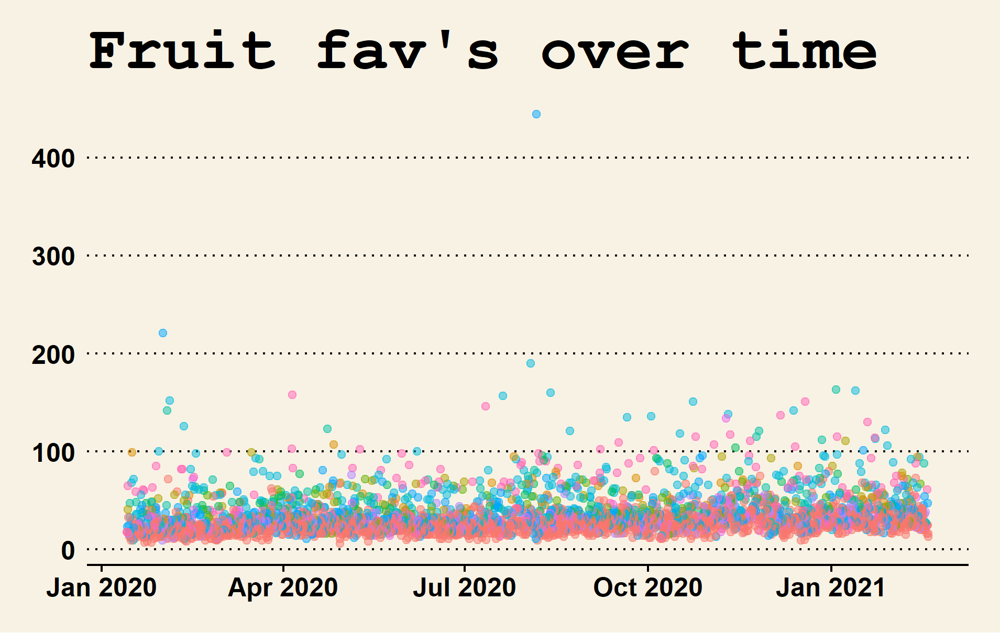

# Analysis of tweets from @pomological

Hello! Welcome to a very important project. I'm analyzing tweets from "old fruit pictures" (@pomological) to see which old fruits people are most impressed with. We've got all the fruits: kumquats; oranges; and lots of apples. I particularly like the apples, but no one else seems to.

Anyway, consider this a placeholder as I patch together what's becoming a rather sprawling little project. In the meantime, please enjoy this enigmatic first graph from my preliminary Exploratory Data Analysis:

Among questions to be answered:

* Who's that way up there with over 400 fav's? (spoiler: it's peaches!)
* Did I really pick out the types of fruit correctly with regex? (uh oh!)
* Who's liking what? Which fruits really resonate with which accounts? (maybe I'll be in there, liking the apples! :apple::dark_sunglasses:)
